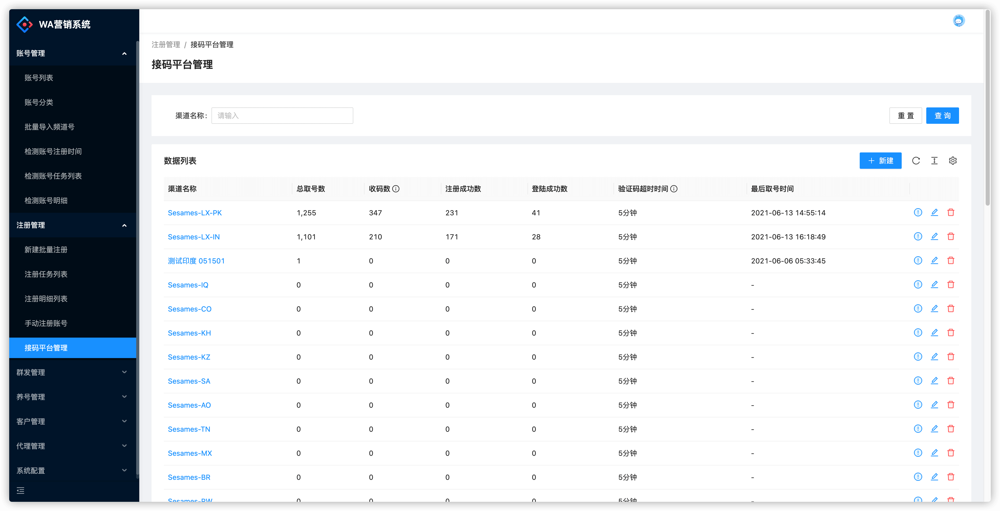
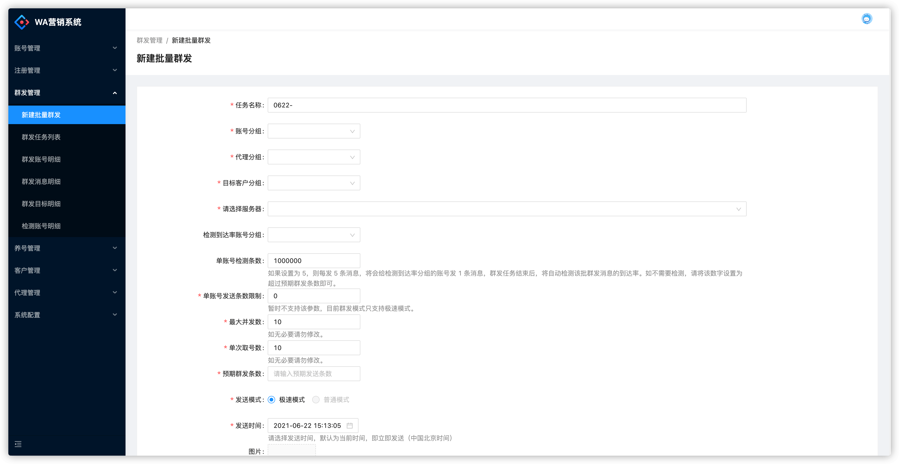
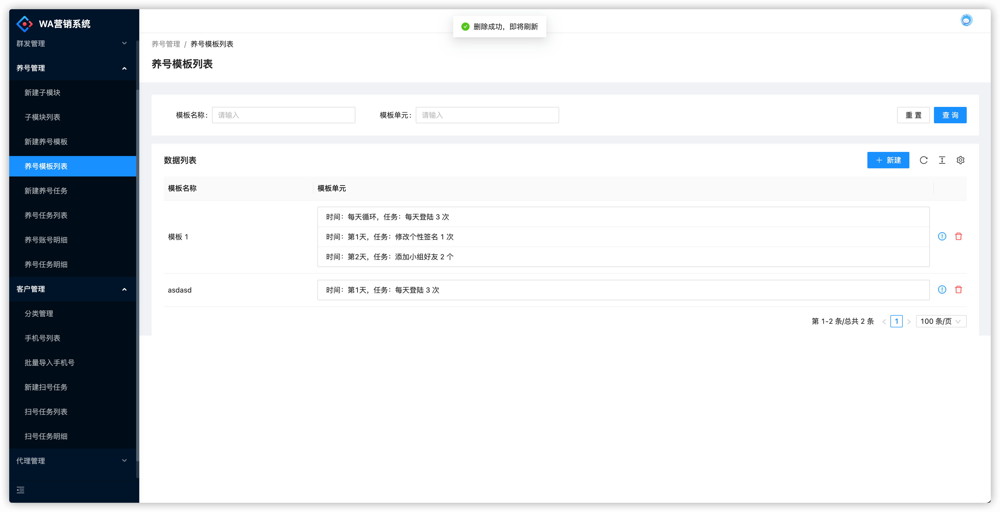

# WhatsApp-Web

* 版本查看地址：https://www.whatsapp.com/android/
* 目前支持的最新版本：2.22.21.71  android 版 
* 更新日期：2022 年 10 月 04 日

### 关于

WhatsApp-Web is a web application based on the WhatsApp-SDK-NodeJS. This application provides some simple and easy-to-use web pages for controlling many WhatsApp accounts and sending messages in batches to achieve the purpose of marketing. 

这是一套基于 WhatsApp SDK 开发的 web 控制端，可以实现对大量账号的批量操作，包括注册、登陆、养号、群发消息等。经过简单适配，本系统即可对接市面上主流的协议 SDK，比如 yowsup 或者其他私人定制的协议 SDK。

### 如何联系

QQ: 8O94O528（请将O替换为数字0）
E-mail: whatsappsdk@qq.com

### 详细描述

本套系统包含：
* 基于 whatsapp 安卓手机版逆向出来的纯协议版 SDK，提供socket 以及 http 接口，可实现单机高并发高负载。
* 基于 sdk 开发的业务系统，包含：批量导入频道号、批量对接接码平台、全自动注册账号、全自动群发消息、新号养号系统、批量导入目标客户手机号、批量扫号等主流功能。

只要您有合适的号源以及客户订单，那么使用本系统即可立即开始群发，开始您的赚钱之路。

whatsapp版本：2.22.21.71 安卓版 （2022 年 10 月 04 日更新）

源码或技术交流请联系QQ：8O94O528（请将O替换为数字0）

SDK 已实现功能（更多功能请私聊）：
- [x] 手机号获取验证码
- [x] 根据验证码注册账号
- [x] 握手协议实现登陆
- [x] 同步通讯录
- [x] 获取联系人签名
- [x] 发消息给联系人
- [x] 输入状态（联系人可看到输入中等状态）
- [x] 群相关（拉群、设置管理员、加人、删人等）
- [x] 发消息到群
- [x] 支持socks代理
- [x] 支持http代理（需要代理支持CONNECT方法）
- [x] 接收通知
- [x] 收联系人消息
- [x] 接收群消息
- [x] 图片消息
- [x] 批量扫号

截图如下：

